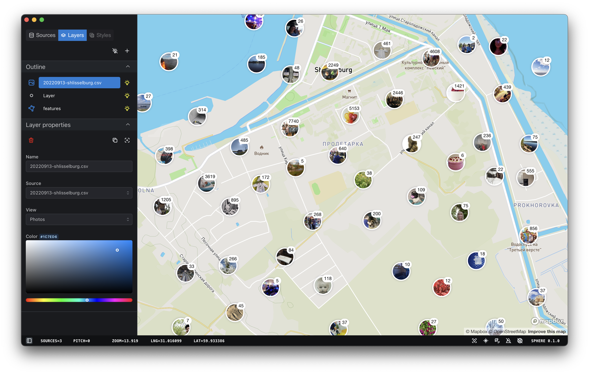

# Sphere

This template should help get you started developing with Tauri, React and Typescript in Vite.

## Recommended IDE Setup

- [VS Code](https://code.visualstudio.com/) + [Tauri](https://marketplace.visualstudio.com/items?itemName=tauri-apps.tauri-vscode) + [rust-analyzer](https://marketplace.visualstudio.com/items?itemName=rust-lang.rust-analyzer)

## Related Links

- [kt-companion.vercel.app](https://kt-companion.vercel.app)
- [gpxstudio.github.io](https://github.com/gpxstudio/gpxstudio.github.io)

