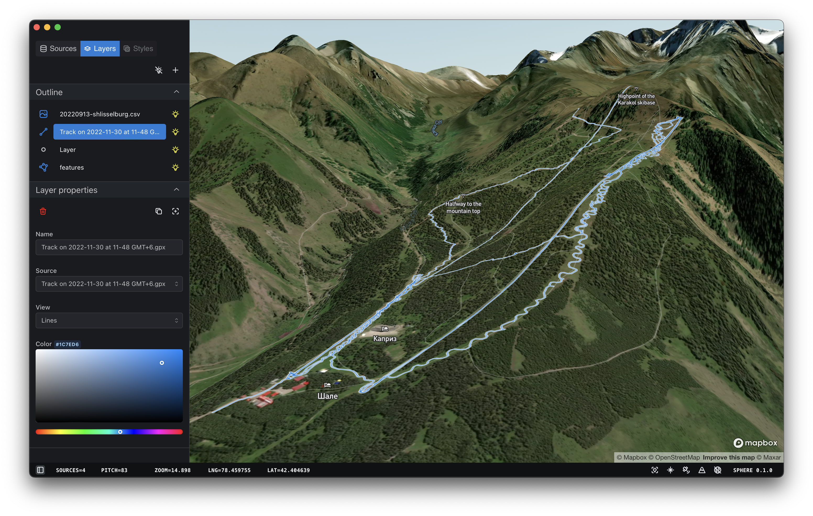

# Sphere





This template should help get you started developing with Tauri, React and Typescript in Vite.

## Recommended IDE Setup

- [VS Code](https://code.visualstudio.com/) + [Tauri](https://marketplace.visualstudio.com/items?itemName=tauri-apps.tauri-vscode) + [rust-analyzer](https://marketplace.visualstudio.com/items?itemName=rust-lang.rust-analyzer)


## Release

### Version locations

The app version is stored in three files that must stay in sync:

| File                       | Field     |
|----------------------------|-----------|
| `package.json`             | `version` |
| `src-tauri/tauri.conf.json`| `version` |
| `src-tauri/Cargo.toml`     | `version` |

The script `scripts/version.js` copies the version from `package.json` into the other two files. It runs automatically as an npm `version` hook.

### How to release

1. Bump the version — pick one of `patch`, `minor`, or `major`:

   ```bash
   npm version patch   # e.g. 0.9.4 → 0.9.5
   ```

   This command:
   - Updates `version` in `package.json`
   - Runs `scripts/version.js` to sync `tauri.conf.json` and `Cargo.toml`
   - Stages the changed files and creates a commit
   - Tags the commit as `v<version>`

2. Push the tag:

   ```bash
   git push --tags
   ```

3. GitHub Actions (`publish.yaml`) picks up the `v*` tag and builds macOS and Windows binaries using `tauri-apps/tauri-action`. A **draft** GitHub Release is created with the build artifacts attached.

4. Open the draft release on GitHub, edit the release notes, and publish it.


## Related Links

- [kt-companion.vercel.app](https://kt-companion.vercel.app)
- [gpxstudio.github.io](https://github.com/gpxstudio/gpxstudio.github.io)
- [geojson.io](https://geojson.io)
- [mapshaper](https://mapshaper.org)
